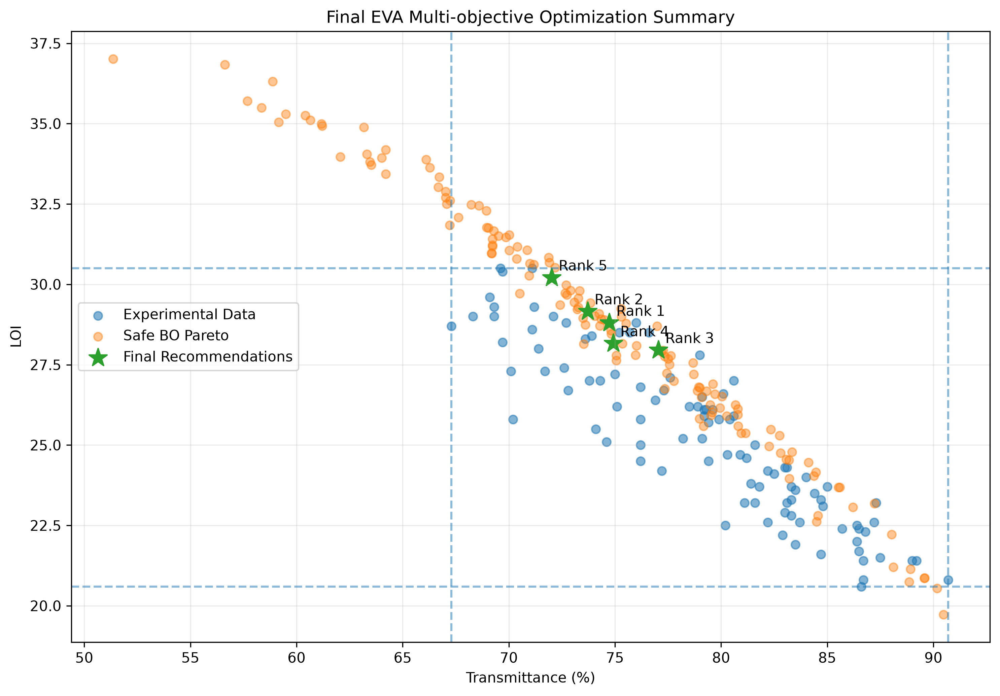
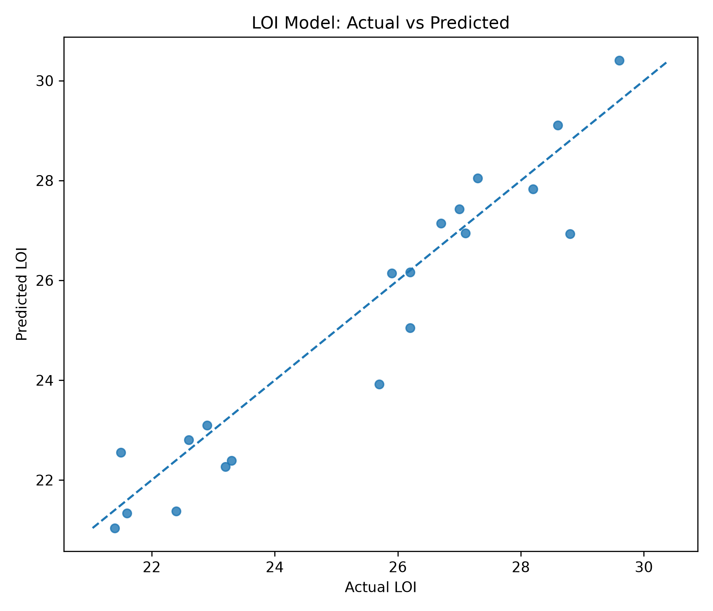
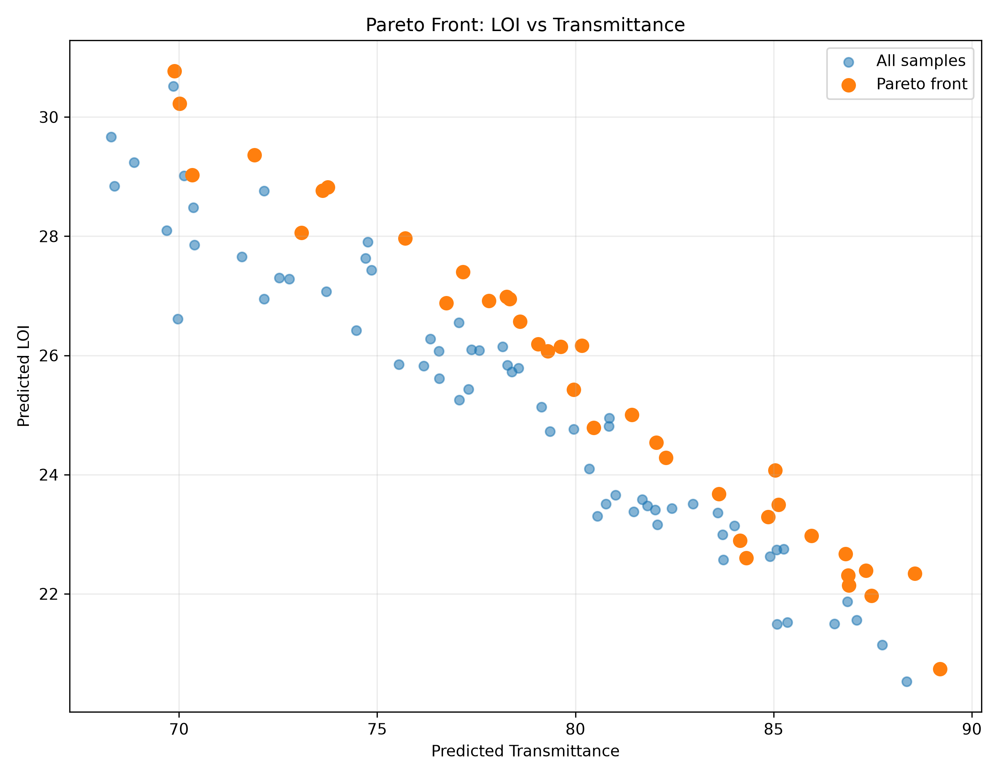
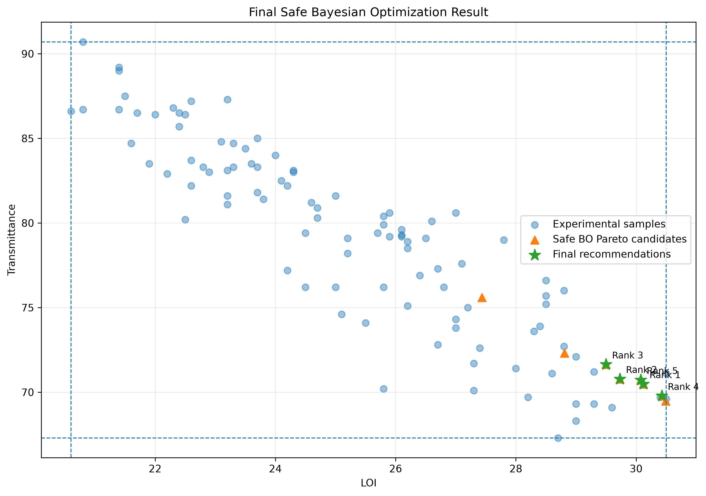

# EVA Polymer Multi-Objective Optimization

> 基于机器学习、多目标优化与安全贝叶斯优化的 EVA 聚合物配方优化项目

## 1. 项目简介

本项目面向 EVA 聚合物材料配方设计，建立了一套从**实验数据分析、机器学习建模、多目标优化到安全贝叶斯优化和最终配方推荐**的完整数据驱动流程。

项目同时考虑三个核心性能指标：

- **LOI**：极限氧指数，越高越好
- **UL-94**：阻燃等级分类
- **Transmittance**：透光率，越高越好

项目最终通过 Pareto Front 和 Safe Bayesian Optimization，在实验数据范围和模型适用域约束下筛选潜在优质配方。

### 项目核心思路

```text
实验数据
   ↓
数据清洗与验证
   ↓
EDA
   ↓
LOI / UL-94 / Transmittance 建模
   ↓
模型诊断
   ↓
多目标预测
   ↓
Pareto Front
   ↓
Bayesian Optimization
   ↓
Applicability Domain
   ↓
Safe Bayesian Optimization
   ↓
最终配方筛选
   ↓
优化结果验证
```

---

## 2. 项目结果概览

本项目基于 **100 组实验数据**完成建模和优化。

最终形成：

- 3 个性能预测模型
- 37 个 Pareto solutions
- 20 个 Safe BO candidates
- 8 个 Safe BO Pareto candidates
- 5 个最终推荐配方
- 5 个最终推荐配方全部通过最终验证

### 项目总结



---

## 3. 数据集

实验数据共包含 **100 组 EVA 配方数据**。

主要输入变量：

| Variable | Description |
|---|---|
| EVA_content | EVA 含量 |
| Polymer_A | 聚合物 A |
| Polymer_B | 聚合物 B |
| FR_A | 阻燃剂 A |
| FR_B | 阻燃剂 B |
| FR_C | 阻燃剂 C |
| FR_D | 阻燃剂 D |
| Additive_1 | 添加剂 1 |
| Additive_2 | 添加剂 2 |

目标变量：

| Target | Description | Optimization |
|---|---|---|
| LOI | 极限氧指数 | Maximize |
| UL-94 | 阻燃等级 | Maximize |
| Transmittance | 透光率 | Maximize |
| Haze | 雾度 | Reference |

所有实验配方经过数据清洗和配方总量检查，满足：

```text
Total formulation = 100 wt%
```

---

## 4. 机器学习建模

项目分别建立三个性能模型。

### 4.1 LOI Regression

比较：

- Linear Regression
- Random Forest

最终选择 **Linear Regression**。

测试集结果：

| Metric | Result |
|---|---:|
| MAE | 0.674 |
| RMSE | 0.843 |
| R² | 0.897 |

---

### 4.2 UL-94 Classification

比较：

- Logistic Regression
- Random Forest

最终根据 Macro F1 选择：

**Logistic Regression**

测试集结果：

| Metric | Result |
|---|---:|
| Accuracy | 0.900 |
| Macro Precision | 0.926 |
| Macro Recall | 0.926 |
| Macro F1 | 0.917 |

UL-94 数据包含：

- NR：37
- V-1：20
- V-2：43

---

### 4.3 Transmittance Regression

比较：

- Linear Regression
- Random Forest

最终选择 **Linear Regression**。

Hold-out test：

| Metric | Result |
|---|---:|
| MAE | 0.898 |
| RMSE | 1.005 |
| R² | 0.974 |

5-fold Cross Validation：

| Metric | Result |
|---|---:|
| MAE | 0.920 ± 0.109 |
| RMSE | 1.124 ± 0.180 |
| R² | 0.958 ± 0.018 |

---

## 5. 模型诊断

模型训练完成后，对回归模型进行了：

- Actual vs Predicted
- Residual Analysis
- Regression Coefficient Analysis

同时对 UL-94 分类模型进行了：

- Confusion Matrix
- Classification Report
- Macro F1 Evaluation

### Actual vs Predicted



该图用于展示模型预测值与实验真实值之间的一致性。

---

## 6. Multi-Objective Optimization

三个模型训练完成后，将预测结果统一到多目标优化框架。

核心优化目标：

```text
Maximize LOI
Maximize Fire Performance
Maximize Transmittance
```

其中 UL-94 分类模型输出概率，并进一步计算 Fire Performance Score，用于统一的多目标评价。

这样可以同时考虑：

**阻燃性能 + 透光性能**

而不是只针对单一性能进行优化。

---

## 7. Pareto Front Analysis

在多目标优化中，不同性能之间存在明显的 trade-off。

因此使用 Pareto Front 对 100 个实验样本进行筛选。

结果：

```text
Total samples: 100
Pareto solutions: 37
```

Pareto 解表示不存在另外一个配方能够在所有目标上同时优于当前配方。

### Pareto Front



该结果展示了 LOI 与 Transmittance 之间的性能权衡关系。

---

## 8. Bayesian Optimization

在已有实验数据基础上建立 Gaussian Process，并生成候选配方。

Standard Bayesian Optimization：

```text
Generated candidates: 20,000
```

候选配方同时满足：

```text
Formulation total = 100 wt%
```

通过 Gaussian Process 对候选配方进行预测，并使用 UCB 等 acquisition strategy 对候选点进行排序。

---

## 9. Standard BO 的问题

Standard Bayesian Optimization 得到的部分候选配方虽然具有较高的预测 Utility，但出现了明显的模型外推。

例如：

```text
Experimental LOI range:
20.60 - 30.50

Standard BO predicted LOI:
up to 36.54
```

同时：

```text
Experimental Transmittance range:
67.30 - 90.70

Standard BO predicted Transmittance:
as low as 57.37
```

这说明：

> 单纯追求模型预测最优值，可能会把优化结果推向训练数据之外。

因此本项目进一步加入 Applicability Domain 和 Safe Bayesian Optimization。

---

## 10. Safe Bayesian Optimization

Safe BO 在 Standard BO 的基础上进一步考虑：

1. 配方总量约束
2. 模型预测性能
3. Gaussian Process uncertainty
4. Applicability Domain
5. 与实验数据的 formulation-space distance

最终：

```text
Valid candidates generated: 18,512

Candidates inside applicability domain:
11,873

Safe BO candidates:
20
```

Safe BO 的核心思想不是：

> 找到模型预测值最高的配方

而是：

> **在模型可信范围内寻找性能较优、风险更低的配方。**

---

## 11. Safe BO 优化结果

Standard BO 和 Safe BO 的最佳结果对比：

| Method | LOI | Transmittance | UL-94 | Utility |
|---|---:|---:|---|---:|
| Experimental Dataset | 30.50 | 90.70 | Experimental | — |
| Standard BO | 36.54 | 57.37 | V-1 | 0.200 |
| Safe BO | 29.24 | 71.11 | V-1 | 0.623 |

可以看到：

Standard BO 获得了更高的预测 LOI，但明显超出实验数据范围。

Safe BO 的预测结果更加接近实验数据，因此在实际配方推荐场景中具有更好的可靠性。

---

## 12. Applicability Domain

为了避免模型在训练数据之外进行过度外推，项目进一步计算候选配方与实验数据之间的 formulation-space distance。

最终确定：

```text
Applicability distance threshold:
0.671
```

最终验证结果：

```text
Safe BO candidates: 20

Within experimental performance range: 14

Inside applicability domain: 20

Final safe candidates: 14

Safe BO Pareto candidates: 8

Valid Safe BO Pareto candidates: 8
```

---

## 13. 最终推荐配方

最终从 Safe BO Pareto candidates 中筛选得到 **5 个最终推荐配方**。

### Rank 1

| Variable | Value |
|---|---:|
| EVA_content | 49.44 |
| Polymer_A | 5 |
| Polymer_B | 15 |
| FR_A | 12.96 |
| FR_B | 8.26 |
| FR_C | 2.39 |
| FR_D | 3.95 |
| Additive_1 | 1.64 |
| Additive_2 | 1.35 |

预测性能：

| Performance | Prediction |
|---|---:|
| LOI | 30.12 |
| UL-94 | V-1 |
| Transmittance | 70.48 |
| Safety-Adjusted Score | 0.496 |

### 5 个最终推荐结果

| Rank | LOI | UL-94 | Transmittance | Safety-Adjusted Score |
|---:|---:|---|---:|---:|
| 1 | 30.12 | V-1 | 70.48 | 0.496 |
| 2 | 29.73 | V-1 | 70.78 | 0.436 |
| 3 | 29.50 | V-1 | 71.64 | 0.397 |
| 4 | 30.43 | V-1 | 69.78 | 0.392 |
| 5 | 30.08 | V-1 | 70.72 | 0.391 |

---

## 14. 最终优化结果



最终 5 个推荐配方均通过最终优化验证：

```text
Final recommendations: 5
Valid final recommendations: 5
```

这说明最终推荐结果均满足项目设定的性能范围和适用域约束。

---

## 15. 项目结构

```text
EVA project/
│
├── data/
│   ├── EVA data 100.xlsx
│   └── polymer_dataset_clean.csv
│
├── docs/
│   └── images/
│       ├── actual_vs_predicted.png
│       ├── final_optimization_result.png
│       ├── pareto_loi_transmittance.png
│       └── project_summary.png
│
├── models/
│   ├── loi_model.pkl
│   ├── ul94_model.pkl
│   └── transmittance_model.pkl
│
├── src/
│   ├── data_cleaning.py
│   ├── eda.py
│   ├── loi_model.py
│   ├── loi_diagnostics.py
│   ├── ul94_model.py
│   ├── ul94_diagnostics.py
│   ├── transmittance_model.py
│   ├── transmittance_diagnostics.py
│   ├── multi_objective_model.py
│   ├── pareto_analysis.py
│   ├── bayesian_optimization.py
│   ├── bo_candidate_evaluation.py
│   ├── safe_bayesian_optimization.py
│   ├── optimization_validation.py
│   └── final_project_report.py
│
├── results/
│   ├── eda/
│   ├── loi_model/
│   ├── ul94_model/
│   ├── transmittance_model/
│   ├── multi_objective/
│   ├── pareto/
│   ├── bayesian_optimization/
│   └── final_project_report/
│
├── README.md
└── requirements.txt
```

---

## 16. 技术栈

- Python
- Pandas
- NumPy
- Scikit-learn
- Matplotlib
- Seaborn
- Gaussian Process
- Bayesian Optimization
- Multi-objective Optimization
- Pareto Front
- Applicability Domain

---

## 17. 项目亮点

### ① 从预测到优化

不是停留在单纯的机器学习预测，而是进一步利用预测模型进行材料配方搜索。

### ② 多目标优化

同时考虑：

```text
LOI
UL-94
Transmittance
```

解决不同性能之间的 trade-off。

### ③ Standard BO → Safe BO

针对 Standard BO 容易产生模型外推的问题，引入：

```text
Applicability Domain
+
Formulation Distance
+
Prediction Constraint
+
Safety Factor
```

提高最终推荐结果的可靠性。

### ④ 完整验证链

整个项目形成：

```text
Data
 ↓
EDA
 ↓
ML Models
 ↓
Model Diagnostics
 ↓
Multi-Objective Optimization
 ↓
Pareto Front
 ↓
Bayesian Optimization
 ↓
Safe Bayesian Optimization
 ↓
Applicability Domain
 ↓
Final Validation
```

最终得到 **5 个经过验证的候选配方**。

---

## 18. 项目总结

本项目建立了一套完整的 EVA 材料数据驱动配方优化流程。

相比传统的：

```text
实验 → 调配 → 测试 → 再实验
```

本项目尝试通过机器学习和优化算法减少盲目实验搜索：

```text
实验数据
   ↓
机器学习建立性能模型
   ↓
预测不同配方性能
   ↓
Pareto 分析性能 trade-off
   ↓
Bayesian Optimization 搜索候选配方
   ↓
Applicability Domain 控制模型外推
   ↓
Safe BO
   ↓
最终实验验证候选配方
```

最终推荐 5 个候选配方，并完成了完整的模型、优化和适用域验证。

> **项目核心价值：利用机器学习 + 多目标优化 + Safe Bayesian Optimization，将有限实验数据转化为可解释的材料配方搜索策略。**